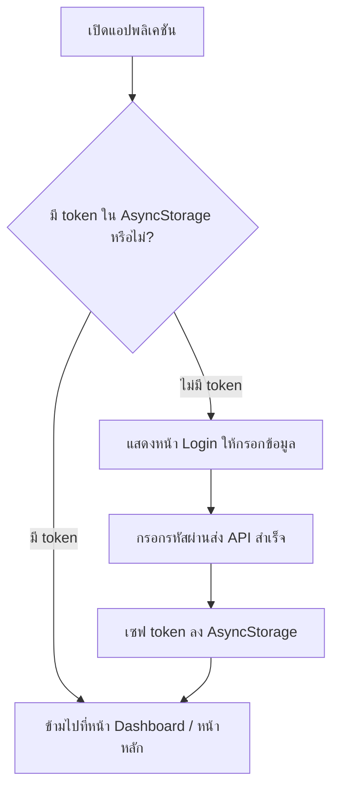

# บทที่ 8: การเก็บข้อมูลในเครื่องและการเชื่อมต่อเครือข่าย API (Content)

ในบทเรียนนี้ เราจะเจาะลึกระบบการจัดการข้อมูลที่มีความมั่นคงถาวรขึ้นไปอีกขั้น โดยเรียนรู้การเขียนบันทึกข้อมูลและเซสชันไว้ในพื้นที่หน่วยความจำของมือถือด้วยคอมโพเนนต์ AsyncStorage รวมถึงสถาปัตยกรรมการติดต่อฐานข้อมูลกับเครื่องแม่ข่ายเซิร์ฟเวอร์ภายนอกผ่านเครือข่ายอินเทอร์เน็ตด้วยคำสั่ง Fetch API ทั้งรูปแบบการดึงข้อมูลและการส่งโพสต์ข้อมูลใหม่ พร้อมแนวทางรับมือกรณีสัญญาณอินเทอร์เน็ตล่ม

---

## 8.1 ความเข้าใจและการติดตั้ง AsyncStorage

แอปพลิเคชันโดยทั่วไป หากเก็บตัวแปรข้อมูลไว้บนระดับสถานะ (State) ของ React ข้อมูลเหล่านั้นจะสูญหายทันทีที่ผู้ใช้ปิดแอป หรือเครื่องโทรศัพท์แบตเตอรี่หมด เพื่อรักษาสภาพความคงอยู่ของข้อมูล (Data Persistence) เช่น การจดจำชื่อโปรไฟล์ หรือโทเค็นการล็อกอิน (Auth Token) เราจะใช้หน่วยเก็บข้อมูลถาวรประเภทคีย์-ค่า (Key-Value Storage) ที่เรียกว่า **AsyncStorage**

### คุณสมบัติหลักของ AsyncStorage:
* **Asynchronous (ทำงานแบบไม่ประสานเวลา):** ทุกคำสั่งการอ่าน เขียน หรือลบข้อมูล จะทำงานเบื้องหลังโดยไม่บล็อกการทริกเกอร์แอนิเมชันหรือการวาดหน้าจอ (คืนค่าเป็น Promise)
* **Persistent (คงอยู่ตลอดไป):** ข้อมูลจะถูกจัดเก็บถาวรในตัวเครื่องจนกว่าแอปพลิเคชันจะถูกถอนการติดตั้ง (Uninstall) หรือมีการรันคำสั่งสั่งล้างข้อมูล
* **String-Only (จัดเก็บเฉพาะสตริง):** ตัวจัดเก็บนี้บันทึกได้เฉพาะข้อมูลที่เป็นข้อความตัวหนังสือ (String) เท่านั้น หากมีข้อมูลประเภทอื่น เช่น ตัวเลข หรือออบเจกต์ จำเป็นต้องมีกระบวนการแปลงค่าก่อนเสมอ

### คำสั่งติดตั้งสำหรับ Expo SDK 54:
```bash
npx expo install @react-native-async-storage/async-storage
```

---

## 8.2 การทำงานพื้นฐานกับ AsyncStorage (CRUD Operations)

ในการเรียกเขียนหรืออ่านข้อมูล เราจำเป็นต้องเรียกใช้คำสั่งผ่านบล็อกคำสั่ง `async/await` เสมอ เพื่อรับประกันว่าข้อมูลถูกเขียนหรืออ่านเสร็จก่อนจะนำผลลัพธ์ไปประมวลผลต่อ

### 1. การเขียนหรืออัปเดตข้อมูล (`setItem`)
```tsx
import AsyncStorage from '@react-native-async-storage/async-storage';

const saveData = async (value: string) => {
  try {
    await AsyncStorage.setItem('user_name', value);
    console.log('บันทึกข้อมูลเรียบร้อยแล้ว');
  } catch (error) {
    console.error('บันทึกผิดพลาด:', error);
  }
};
```

### 2. การอ่านข้อมูลเดิมกลับมาใช้ (`getItem`)
```tsx
const loadData = async () => {
  try {
    const value = await AsyncStorage.getItem('user_name');
    if (value !== null) {
      console.log('ข้อมูลที่อ่านได้:', value);
    }
  } catch (error) {
    console.error('อ่านข้อมูลผิดพลาด:', error);
  }
};
```

### 3. การลบข้อมูลบางชิ้น (`removeItem`)
```tsx
const removeData = async () => {
  try {
    await AsyncStorage.removeItem('user_name');
    console.log('ลบข้อมูลสำเร็จ');
  } catch (error) {
    console.error('ลบข้อมูลผิดพลาด:', error);
  }
};
```

---

## 8.3 การบันทึกและดึงข้อมูลออบเจกต์ซับซ้อน (JSON Serialization)

เนื่องจาก AsyncStorage สนับสนุนการบันทึกเฉพาะชนิดข้อมูล String หากเราส่งโครงสร้างประเภทออบเจกต์ (Object) หรืออาร์เรย์ (Array) ไปตรง ๆ ระบบจะไม่สามารถทำงานได้ถูกต้อง เราจึงต้องแปลงรูปแบบข้อมูลให้เป็นรูปแบบสตริงด้วยการทำ Serialization

* **ก่อนทำการบันทึก:** แปลงออบเจกต์ให้เป็นสตริงด้วย **`JSON.stringify(object)`**
* **หลังจากดึงข้อมูลกลับมา:** แปลงสตริงกลับไปเป็นออบเจกต์ด้วย **`JSON.parse(string)`**

```tsx
import AsyncStorage from '@react-native-async-storage/async-storage';

interface UserProfile {
  name: string;
  age: number;
  skills: string[];
}

// 1. ฟังก์ชันบันทึกข้อมูลประเภทออบเจกต์ลงเครื่อง
export const saveUserProfile = async (profile: UserProfile) => {
  try {
    const jsonString = JSON.stringify(profile); // แปลง Object เป็น JSON String
    await AsyncStorage.setItem('user_profile', jsonString);
  } catch (e) {
    console.error('บันทึกออบเจกต์ผิดพลาด:', e);
  }
};

// 2. ฟังก์ชันดึงและแปลงข้อมูลกลับมาเป็นออบเจกต์เดิม
export const getUserProfile = async (): Promise<UserProfile | null> => {
  try {
    const jsonString = await AsyncStorage.getItem('user_profile');
    return jsonString != null ? JSON.parse(jsonString) : null; // แปลง JSON String กลับเป็น Object
  } catch (e) {
    console.error('ดึงออบเจกต์ผิดพลาด:', e);
    return null;
  }
};
```

---

## 8.4 การดึงข้อมูลจาก API ด้วย Fetch (HTTP GET)

นอกเหนือจากการเก็บข้อมูลภายในเครื่องแล้ว โมบายแอปพลิเคชันส่วนใหญ่จำเป็นต้องมีการทำงานร่วมกับระบบเซิร์ฟเวอร์หลังบ้านผ่านสถาปัตยกรรม REST API คำสั่งมาตรฐานที่รองรับการใช้งานใน Expo โดยไม่ต้องติดตั้งไลบรารีภายนอกเพิ่มคือ **`fetch()`**

ตัวอย่างคำสั่งดึงข้อมูลล่าสุด (GET) จากเซิร์ฟเวอร์ JSONPlaceholder:

```tsx
import { useState, useEffect } from 'react';
import { View, Text, ActivityIndicator } from 'react-native';

export default function ApiGetExample() {
  const [data, setData] = useState<any>(null);
  const [loading, setLoading] = useState(true);

  useEffect(() => {
    // ฟังก์ชันดึงข้อมูลแบบ Asynchronous
    const fetchPost = async () => {
      try {
        const response = await fetch('https://jsonplaceholder.typicode.com/posts/1');
        const json = await response.json(); // แปลงการตอบสนองกลับเป็นออบเจกต์
        setData(json);
      } catch (error) {
        console.error('เกิดข้อผิดพลาดในการดึงข้อมูล:', error);
      } finally {
        setLoading(false);
      }
    };

    fetchPost();
  }, []);

  if (loading) return <ActivityIndicator size="large" />;

  return (
    <View style={{ padding: 20 }}>
      {data && (
        <>
          <Text style={{ fontWeight: 'bold', fontSize: 18 }}>{data.title}</Text>
          <Text style={{ marginTop: 10 }}>{data.body}</Text>
        </>
      )}
    </View>
  );
}
```

---

## 8.5 การส่งข้อมูลขึ้นเซิร์ฟเวอร์ด้วย Fetch (HTTP POST)

การสร้างข้อมูลชิ้นใหม่บนเซิร์ฟเวอร์ (เช่น การส่งแบบฟอร์มสมัครสมาชิก, การตั้งกระทู้ใหม่) จะทำงานผ่านการส่ง Request ในรูปแบบ **HTTP POST** ซึ่งเราต้องระบุอ็อพชันหลัก 3 อย่างในพารามิเตอร์ที่สองของคำสั่ง `fetch()`:

1. **`method`**: กำหนดให้เป็นสตริง `'POST'`
2. **`headers`**: กำหนดประเภทข้อมูลที่ส่งไป เช่น `'Content-Type': 'application/json'`
3. **`body`**: ข้อมูล JSON ที่ถูกจัดทำการแปลงเป็นสตริงด้วย `JSON.stringify(data)`

```tsx
import { useState } from 'react';
import { View, TextInput, Button, Alert, ActivityIndicator, StyleSheet } from 'react-native';

export default function SendPostScreen() {
  const [title, setTitle] = useState('');
  const [body, setBody] = useState('');
  const [submitting, setSubmitting] = useState(false);

  const handleSubmit = async () => {
    if (!title || !body) {
      Alert.alert('กรุณากรอกข้อมูล', 'จำเป็นต้องกรอกทั้งหัวเรื่องและเนื้อหา');
      return;
    }

    try {
      setSubmitting(true);
      
      // ส่งข้อมูล POST Request ไปยังเป้าหมายภายนอก
      const response = await fetch('https://jsonplaceholder.typicode.com/posts', {
        method: 'POST',
        headers: {
          'Content-Type': 'application/json; charset=UTF-8',
        },
        body: JSON.stringify({
          title: title,
          body: body,
          userId: 1,
        }),
      });

      if (response.ok) {
        const result = await response.json();
        // แสดงการตอบรับความสำเร็จจากเซิร์ฟเวอร์ (เช่น รหัสไอดี 101)
        Alert.alert('ส่งข้อมูลสำเร็จ!', `สร้างโพสต์ใหม่รหัส ID: ${result.id}`);
        setTitle('');
        setBody('');
      } else {
        throw new Error('เกิดข้อผิดพลาดจากฝั่งเซิร์ฟเวอร์');
      }
    } catch (error: any) {
      Alert.alert('การส่งข้อมูลล้มเหลว', error.message || 'กรุณาตรวจสอบสัญญาณอินเทอร์เน็ต');
    } finally {
      setSubmitting(false);
    }
  };

  return (
    <View style={styles.container}>
      <TextInput
        style={styles.input}
        placeholder="กรอกหัวเรื่อง (Title)"
        value={title}
        onChangeText={setTitle}
      />
      <TextInput
        style={[styles.input, styles.textArea]}
        placeholder="กรอกเนื้อหาโพสต์ (Body)"
        value={body}
        onChangeText={setBody}
        multiline
      />
      {submitting ? (
        <ActivityIndicator size="small" color="#38bdf8" />
      ) : (
        <Button title="ส่งโพสต์ขึ้นเซิร์ฟเวอร์" onPress={handleSubmit} />
      )}
    </View>
  );
}

const styles = StyleSheet.create({
  container: { padding: 20 },
  input: {
    borderWidth: 1,
    borderColor: '#ccc',
    padding: 10,
    borderRadius: 8,
    marginBottom: 12,
  },
  textArea: {
    height: 100,
    textAlignVertical: 'top',
  },
});
```

---

## 8.6 ระบบจัดการสถานะ Loading และการดักจับข้อผิดพลาด (Error Handling)

สุนทรียภาพที่ดีของโมบายแอปพลิเคชัน คือการแจ้งให้ผู้ใช้งานรับรู้อย่างชัดเจนว่าแอปพลิเคชันกำลังดำเนินกิจกรรมอะไรอยู่ และสามารถดักจับสถานการณ์เมื่อไม่สามารถติดต่อเซิร์ฟเวอร์ได้

### แนวทางการจัดการสถานะข้อมูล:
1. **สถานะ Loading (`isLoading`):** ตั้งค่าเป็น `true` ก่อนที่กระบวนการ `fetch()` จะเริ่มขึ้น และตั้งคืนเป็น `false` เสมอในบล็อก `finally` เพื่อปิดไอคอนตัวหมุน
2. **สถานะ Error (`error`):** ใช้บล็อก `try-catch` ในการสกัดกั้นข้อผิดพลาดของอินเทอร์เน็ต หากพบอาการขัดข้องให้เก็บออบเจกต์ข้อผิดพลาดไว้แสดงหน้าจอแจ้งเตือนปุ่มรีเฟรช (Retry Button)
3. **ตรวจสอบรหัสสถานะความสำเร็จ (`response.ok`):** ในบางครั้งเครือข่ายสัญญาณดีมากแต่ฐานข้อมูลปลายทางมีปัญหา (เช่น ส่งรหัส 404 หรือ 500 กลับมา) ตัวคำสั่ง `fetch` จะไม่ทริกเกอร์เข้าบล็อก `catch` อัตโนมัติ เราจึงต้องเขียนดักเช็คค่าของ `response.ok` (มีค่าเป็น true เมื่อ status อยู่ในช่วง 200-299) ด้วยตัวเอง

---

## 8.7 การประยุกต์ใช้ในการทำระบบจำเซสชันการล็อกอิน (Auth Token Caching)

หนึ่งในการประยุกต์ใช้งาน AsyncStorage ที่พบเจอได้บ่อยที่สุดในโปรเจกต์เชิงพาณิชย์คือ การจัดการระบบล็อกอินเข้าใช้งานของสมาชิก โดยหลังจากผู้ใช้ทำการล็อกอินสำเร็จ โทเค็น (Token) จะถูกเก็บไว้ใน AsyncStorage เพื่อที่การเปิดแอปใช้งานครั้งถัดไป ผู้ใช้จะไม่ต้องกรอกรหัสผ่านซ้ำอีกรอบ

### แผนภาพการไหลของระบบจดจำล็อกอิน:


ตัวอย่างโครงสร้างโค้ดการจัดการตรวจสอบสิทธิ์ตอนเริ่มต้นเปิดแอป:

```tsx
import { useEffect, useState } from 'react';
import { View, Text, Button, StyleSheet, ActivityIndicator } from 'react-native';
import AsyncStorage from '@react-native-async-storage/async-storage';

export default function AppSessionManager() {
  const [appReady, setAppReady] = useState(false);
  const [userToken, setUserToken] = useState<string | null>(null);

  // ตรวจเช็คโทเค็นที่ถูกแคชไว้ตอนเปิดแอป
  useEffect(() => {
    const checkToken = async () => {
      try {
        const token = await AsyncStorage.getItem('user_auth_token');
        if (token) {
          setUserToken(token); // อัปเดตสเตตหากพบข้อมูลเก่า
        }
      } catch (e) {
        console.error(e);
      } finally {
        setAppReady(true);
      }
    };
    checkToken();
  }, []);

  // ฟังก์ชันจำลองล็อกอิน
  const handleLogin = async () => {
    const mockToken = 'jwt-secure-token-123456';
    await AsyncStorage.setItem('user_auth_token', mockToken);
    setUserToken(mockToken);
  };

  // ฟังก์ชันล็อกเอาต์
  const handleLogout = async () => {
    await AsyncStorage.removeItem('user_auth_token');
    setUserToken(null);
  };

  if (!appReady) {
    return (
      <View style={styles.center}>
        <ActivityIndicator size="large" />
      </View>
    );
  }

  return (
    <View style={styles.container}>
      {userToken ? (
        <View>
          <Text style={styles.text}>🔐 ยินดีต้อนรับกลับ! เข้าสู่ระบบสำเร็จ</Text>
          <Text style={styles.subText}>Token: {userToken}</Text>
          <Button title="ออกจากระบบ (Logout)" color="#ef4444" onPress={handleLogout} />
        </View>
      ) : (
        <View>
          <Text style={styles.text}>🔓 กรุณาลงชื่อเข้าใช้งาน</Text>
          <Button title="ลงชื่อเข้าใช้จำลอง (Login)" onPress={handleLogin} />
        </View>
      )}
    </View>
  );
}

const styles = StyleSheet.create({
  container: { flex: 1, justifyContent: 'center', alignItems: 'center', backgroundColor: '#f1f5f9' },
  center: { flex: 1, justifyContent: 'center', alignItems: 'center' },
  text: { fontSize: 18, fontWeight: 'bold', marginBottom: 10, textAlign: 'center' },
  subText: { fontSize: 13, color: '#64748b', marginBottom: 20, textAlign: 'center' },
});
```

## 8.8 สรุปท้ายบทเรียน

**ความเข้าใจและการติดตั้ง AsyncStorage:** AsyncStorage เป็นเครื่องมือสำคัญในการรักษาความคงอยู่ของข้อมูล in ระดับอุปกรณ์ประเภทคีย์-ค่า (Key-Value) แบบทำงานเบื้องหลังโดยไม่รบกวนหน้าจอ (Asynchronous) ซึ่งข้อมูลจะอยู่ถาวรยกเว้นแต่จะถอนติดตั้งหรือสั่งล้างข้อมูล โดยใน Expo SDK 54 เราสามารถติดตั้งมาใช้งานได้สะดวกผ่านคำสั่ง npx expo install เพื่อนำมาจัดเก็บข้อมูลถาวร เช่น การตั้งค่าหรือเซสชันล็อกอิน

**การทำงานพื้นฐานกับ AsyncStorage (CRUD Operations):** กระบวนการทำงานพื้นฐานในการเก็บและดึงข้อมูล AsyncStorage จะใช้คำสั่ง async/await ในการประสานงาน โดยมีคำสั่งหลักที่สำคัญคือ setItem สำหรับเขียนหรืออัปเดตข้อมูล, getItem เพื่อดักเรียกอ่านข้อมูลเดิมกลับมาประมวลผลต่อ และ removeItem สำหรับการสั่งลบข้อมูลแต่ละรายการที่ระบุค่าคีย์ไว้

**การบันทึกและดึงข้อมูลออบเจกต์ซับซ้อน (JSON Serialization):** เนื่องจาก AsyncStorage รองรับข้อมูลชนิดข้อความสตริงเท่านั้น เมื่อต้องการจัดเก็บข้อมูลซับซ้อนประเภทออบเจกต์หรืออาร์เรย์ ผู้พัฒนาจำเป็นต้องแปลงข้อมูลเป็นสตริงผ่านกระบวนการ JSON.stringify(object) ก่อนนำลงไปเก็บบันทึก และทำการแปลงข้อมูลสตริงสกัดกลับเป็นออบเจกต์ดั้งเดิมผ่าน JSON.parse(string) หลังเรียกขึ้นมาใช้งาน

**การดึงข้อมูลจาก API ด้วย Fetch (HTTP GET):** การประมวลผลดึงข้อมูล API ภายนอกมายังแอปพลิเคชันจะทำงานผ่านฟังก์ชัน fetch() ของระบบเพื่อยิง GET Request ไปยังจุดปลายของเซิร์ฟเวอร์ปลายทาง โดยเรียกใช้คำสั่งควบคู่กับ useEffect ในการดึงข้อมูลสดเมื่อเริ่มรันแอป และทำการแปลงค่าการตอบสนองเป็นโครงสร้างออบเจกต์ด้วยเมธอด .json() ก่อนนำไปแจกจ่าย

**การส่งข้อมูลขึ้นเซิร์ฟเวอร์ด้วย Fetch (HTTP POST):** การส่งข้อมูลใหม่ขึ้นฝั่งเซิร์ฟเวอร์ภายนอกใช้วิธีส่งแบบ HTTP POST ผ่านการระบุอ็อพชันเพิ่มเติมใน fetch() โดยระบุ method: 'POST', ระบุประเภท content-type เป็น JSON ในส่วนของ headers และส่งข้อมูลหลักที่ถูกแปลงเป็นสตริงด้วย JSON.stringify ในส่วนของ body ซึ่งช่วยให้เราสามารถสมัครสมาชิกหรือโพสต์ข้อมูลได้สำเร็จ

**ระบบจัดการสถานะ Loading และการดักจับข้อผิดพลาด:** การเพิ่มสัมผัสความลื่นไหลในการใช้บริการเน็ตเวิร์กจำต้องมีการจัดการสถานะ Loading เพื่อควบคุมการแสดง ActivityIndicator และครอบคลุมระบบดักจับปัญหา Error Handling ผ่านบล็อก try-catch เพื่อดักจับสัญญาณอินเทอร์เน็ตล่ม โดยต้องทำการตรวจสอบค่าผลลัพธ์ผ่าน response.ok ควบคู่กันเพื่อป้องกันกรณีเซิร์ฟเวอร์ส่งข้อผิดพลาดกลับมา

**การประยุกต์ใช้ในการทำระบบจำเซสชันการล็อกอิน:** การประยุกต์ใช้ AsyncStorage และเน็ตเวิร์ก API ที่มีความสำคัญในแอปพลิเคชันเชิงพาณิชย์คือระบบเซสชันการเข้าสู่ระบบ โดยหลังจากยืนยันตัวตนสำเร็จแล้วจะนำ Auth Token ไปบันทึกลงในเครื่อง และเมื่อเปิดแอปใหม่จะสามารถดักจับโทเค็นดังกล่าวมาล็อกอินอัตโนมัติ ช่วยลดความซับซ้อนให้ผู้ใช้งานไม่ต้องป้อนข้อมูลซ้ำซ้อน

---

← [ย้อนกลับแผนการสอน: 01-lesson-plan.md](./01-lesson-plan.md) | [กลับหน้าสารบัญหลัก (Course Index)](../README.md) | [ทำแบบทดสอบถัดไป: 03-quiz.md](./03-quiz.md) →
