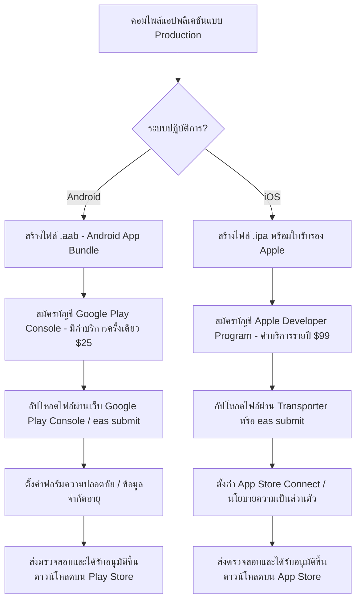

# บทที่ 13: การดีบั๊ก การสร้างแอปพลิเคชัน และการเผยแพร่ด้วย EAS Build (Content)

การพัฒนาโมบายแอปพลิเคชันจนสามารถพิมพ์โค้ดรันได้ในเครื่องจำลอง (Simulator) ถือเป็นเพียงครึ่งแรกของกระบวนการพัฒนา ด่านสำคัญถัดไปคือการแกะรอยแก้ไขข้อผิดพลาดในระดับอุปกรณ์จริง (Native Debugging) และการแปลงซอร์สโค้ด React Native ให้กลายเป็นไฟล์ติดตั้งไบนารีเนทีฟ (เช่น `.apk` สำหรับ Android หรือ `.ipa` สำหรับ iOS) เพื่อส่งขึ้น Store ในบทเรียนสุดท้ายนี้ เราจะเรียนรู้เทคนิคการดีบั๊กใน Expo SDK 54, ทำความเข้าใจระบบคลาวด์คอมไพล์แอป **EAS Build** และขั้นตอนเตรียมความพร้อมเพื่อเผยแพร่แอปพลิเคชันสู่ผู้ใช้งานจริงทั่วโลก

---

## 13.1 เทคนิคการตรวจสอบและแก้ไขข้อผิดพลาดใน Expo SDK 54 (Debugging)

ในการเขียนแอปพลิเคชัน ย่อมเกิดข้อผิดพลาดหรือข้อขัดข้องขึ้นได้ ทั้งจากโค้ดจาวาสคริปต์ของเราเอง หรือเออเรอร์ระดับเครื่องยนต์เนทีฟ (Native Crash) Expo SDK 54 ได้จัดสรรเครื่องมือในการค้นหาความจริงดังนี้:

### 1. การเรียกใช้งาน Expo Developer Menu
ขณะรันแอปบนจำลองหรือสมาร์ทโฟนจริงผ่าน Expo Go เราสามารถกดเปิดเมนูผู้พัฒนาได้โดย:
* **ในเครื่อง Simulator:** กดปุ่ม **`m`** บนคีย์บอร์ดในเทอร์มินัลที่รัน Expo CLI
* **ในสมาร์ทโฟนจริง:** ทำการ **เขย่าโทรศัพท์มือถือ (Shake Device)** 

ในเมนูนี้เราสามารถสั่งรีโหลดแอปใหม่ทั้งหมด (Reload) หรือเปิดใช้งานเครื่องมือการสืบค้นองค์ประกอบ UI (Toggle Inspector)

### 2. การเชื่อมต่อ Chrome Developer Tools
เราสามารถดีบั๊กโค้ด JavaScript ที่กำลังรันอยู่บนโทรศัพท์มือถือผ่านเครื่องมืออันคุ้นเคยของ Google Chrome โดยเปิดบราวเซอร์ Chrome ขึ้นมาแล้วทำตามขั้นตอนดังนี้:
1. เปิด Developer Tools ใน Chrome (กด `F12`)
2. กดปุ่ม `Ctrl + Shift + P` (หรือ `Cmd + Shift + P` บน Mac) พิมพ์คำสั่ง **`Open Debugger`** หรือคลิกที่ลิงก์ดีบั๊กเกอร์ที่ Expo CLI แสดงขึ้นในหน้าต่างเทอร์มินัล (มักเป็นคีย์ลัด **`j`** ในคอมพิวเตอร์)
3. ระบบจะสลับหน้าจอไปที่แถบดีบั๊กเกอร์ ซึ่งเปิดโอกาสให้เราสามารถดักจับตัวแปรในหน้า Console, ใส่จุดหยุดทำงาน (Breakpoints) และตรวจสอบตาราง Call Stack ได้ทันทีเสมือนการพัฒนาเว็บแอปพลิเคชัน

---

## 13.2 สถาปัตยกรรมและหลักการของ Expo Application Services (EAS)

ในอดีต การสร้างไฟล์ติดตั้ง (Build App) ของ React Native เป็นเรื่องยุ่งยากอย่างมหาศาล เพราะนักพัฒนาจำเป็นต้องตั้งค่าแอนดรอยด์ SDK อย่างหนาแน่นในเครื่อง หรือหากต้องการสร้างไฟล์สำหรับ iOS ก็ถูกบังคับให้ต้องมีเครื่องคอมพิวเตอร์ Mac ที่ลงระบบ Xcode เท่านั้น

เพื่อขจัดความยุ่งยากนี้ Expo จึงได้พัฒนาบริการคลาวด์สำเร็จรูปที่ชื่อว่า **EAS (Expo Application Services)** ซึ่งเป็นระบบเซิร์ฟเวอร์คลาวด์ประสิทธิภาพสูงที่จะคอยรับโค้ดของเราขึ้นไปคอมไพล์เป็นไฟล์ติดตั้งเนทีฟให้โดยอัตโนมัติ

### ข้อดีของ EAS Build:
* **ไม่ต้องมีเครื่อง Mac ก็สร้างแอป iOS ได้:** เพราะการ Build เกิดขึ้นบนเซิร์ฟเวอร์คลาวด์ของ Expo เอง
* **ประหยัดทรัพยากรเครื่องคอมพิวเตอร์:** ไม่ต้องรันคอมไพล์หนักหน่วงจน RAM เต็มในเครื่องโลคัลของเรา
* **จัดการคีย์ความปลอดภัยให้อัตโนมัติ:** คอยดูแลและสร้างใบรับรองดิจิทัล (Signing Credentials) สำหรับแอนดรอยด์และ iOS ให้ปลอดภัย

---

## 13.3 การจัดเตรียมความพร้อมแอปพลิเคชันใน `app.json`

ก่อนที่เราจะส่งโค้ดขึ้นไปประกอบเป็นไฟล์แอปพลิเคชันบนคลาวด์ เราต้องระบุคุณลักษณะที่จำเป็นในไฟล์ **`app.json`** ซึ่งทำหน้าที่เสมือนบัตรประชาชนระบุตัวตนของแอปพลิเคชัน:

```json
{
  "expo": {
    "name": "My Personal Diary",       // ชื่อแอปที่จะโชว์ใต้ไอคอนบนหน้าจอโทรศัพท์
    "slug": "my-personal-diary",
    "version": "1.0.0",                 // เลขเวอร์ชันของแอปที่โชว์ให้ผู้ใช้เห็น
    "orientation": "portrait",
    "icon": "./assets/icon.png",        // ที่อยู่รูปภาพไอคอนแอปพลิเคชัน
    "userInterfaceStyle": "dark",
    "splash": {
      "image": "./assets/splash-image.png", // หน้าจอต้อนรับตอนเปิดแอป (Splash Screen)
      "resizeMode": "contain",
      "backgroundColor": "#0f172a"
    },
    "ios": {
      "supportsTablet": true,
      "bundleIdentifier": "com.yourdomain.mydiary", // รหัสระบุตัวตนห้ามซ้ำของ iOS
      "buildNumber": "1"
    },
    "android": {
      "adaptiveIcon": {
        "foregroundImage": "./assets/adaptive-icon.png",
        "backgroundColor": "#0f172a"
      },
      "package": "com.yourdomain.mydiary",         // รหัสระบุตัวตนห้ามซ้ำของ Android (Package Name)
      "versionCode": 1                             // เลขรันของรุ่นแอปในสารระบบดาต้าเบสสโตร์ (ต้องเพิ่มค่าขึ้นทีละ 1 ทุกครั้งที่อัปเดตสโตร์)
    }
  }
}
```

> [!WARNING]
> ฟิลด์ `android.package` และ `ios.bundleIdentifier` ต้องใช้รูปแบบจดโดเมนย้อนกลับ (Reverse Domain Name) เช่น `com.บริษัท.ชื่อแอป` และชื่อนี้ห้ามไปซ้ำกับแอปพลิเคชันอื่นใดในโลกเด็ดขาด มิฉะนั้นสโตร์จะปฏิเสธการอัปโหลดเข้าสู่คลังระบบ

---

## 13.4 การตั้งค่าโปรไฟล์การคอมไพล์ใน `eas.json`

เราสามารถกำหนดค่าพฤติกรรมการคอมไพล์แอปแยกประเภทได้ผ่านไฟล์ **`eas.json`** (ซึ่งตั้งอยู่ที่โฟลเดอร์นอกสุดของโปรเจกต์) โดยเรามักสร้างไฟล์นี้อัตโนมัติด้วยคำสั่ง:
```bash
eas build:configure
```

### ตัวอย่างการกำหนดค่าในไฟล์ `eas.json`:
สำหรับการนำมาสอนหรือทดสอบติดตั้งเองในเครื่อง โดยไม่ต้องส่งขึ้นสโตร์ทันที เราจะตั้งค่าโปรไฟล์สำหรับดาวน์โหลดไฟล์ **APK** (สำหรับ Android) เอาไว้ทดลองรันภายในองค์กร (Internal Distribution) ดังนี้:

```json
{
  "cli": {
    "version": ">= 10.0.0"
  },
  "build": {
    "development": {
      "developmentClient": true,
      "distribution": "internal"
    },
    "preview": {
      "distribution": "internal",
      "android": {
        "buildType": "apk"          // บังคับให้คอมไพล์ออกมาเป็นไฟล์ติดตั้งด่วนประเภท .apk
      }
    },
    "production": {
      "distribution": "store"       // บังคับเตรียมไฟล์สำหรับส่งขึ้น App Store / Play Store
    }
  }
}
```

---

## 13.5 ขั้นตอนการสั่งรันคอมไพล์ด้วยคำสั่ง EAS CLI

เมื่อเตรียมความพร้อมไฟล์คอนฟิกสำเร็จแล้ว ให้ทำตามขั้นตอนการยิงคำสั่งคอมไพล์จริงบนคลาวด์ดังนี้:

### ขั้นตอนที่ 1: ติดตั้ง EAS CLI ส่วนกลางในเครื่องคอมพิวเตอร์ของคุณ
```bash
npm install -g eas-cli
```

### ขั้นตอนที่ 2: ลงชื่อเข้าใช้บัญชี Expo
ทำการล็อกอินระบบด้วยบัญชีที่สมัครไว้กับเว็บไซต์ Expo:
```bash
eas login
```

### ขั้นตอนที่ 3: สั่งรันเริ่มคอมไพล์ภาพแอป
ส่งคำสั่งสั่งรันโปรไฟล์ `preview` เพื่อสร้างไฟล์ติดตั้ง APK สำหรับ Android:
```bash
eas build --platform android --profile preview
```

### ขั้นตอนที่เกิดขึ้นเบื้องหลัง (Build Pipeline):
1. **EAS CLI** จะตรวจสอบความถูกต้องของไฟล์ `app.json` และ `eas.json`
2. ระบบจะบีบอัดแพ็คเกจซอร์สโค้ดฝั่ง Client (เฉพาะโค้ดดิ้ง ไม่รวมโฟลเดอร์ node_modules) ส่งผ่านสายขึ้นคลาวด์ของ Expo
3. คลาวด์ของ Expo จะเปิดระบบจำลองเซิร์ฟเวอร์ขึ้นมาทำการติดตั้งแพ็คเกจและทำลายคอมไพล์โค้ดเป็นไบนารีระดับเนทีฟ
4. เมื่อกระบวนการเสร็จสิ้น เทอร์มินัลของคุณจะแสดง **ลิงก์ดาวน์โหลดเว็บ** พร้อมกับรหัส **QR Code** ขึ้นมาบนหน้าจอคอมพิวเตอร์
5. ผู้เรียนสามารถนำกล้องถ่ายรูปของสมาร์ทโฟนแอนดรอยด์สแกน QR Code นี้เพื่อเปิดดาวน์โหลดไฟล์ติดตั้ง `.apk` มาติดตั้งรันทำงานบนโทรศัพท์มือถือจริงได้ทันที!

---

## 13.6 แนวทางและกระบวนการเผยแพร่แอปขึ้น App Stores

เมื่อผู้พัฒนาทดสอบแอปจนมั่นใจและพร้อมที่จะเผยแพร่ให้คนดาวน์โหลดใช้งานทั่วไป ขั้นตอนการดำเนินงานขึ้นร้านค้าทางการมีดังนี้:



### การส่งด้วยความสามารถคำสั่งอัตโนมัติ (EAS Submit):
หลังจากที่สร้างแอปแบบโปรไฟล์การผลิตเสร็จสิ้น เราสามารถสั่งส่งอัปโหลดตรงเข้าร้านค้าสโตร์ต่างๆ ผ่านคำสั่ง:
```bash
eas submit --platform android
```
คำสั่งนี้จะดึง Credentials และเชื่อม API ไดเรกทอรีของสโตร์เพื่อส่งมอบแอปขึ้นไปเตรียมรีวิวในฝั่งหลังบ้านได้อย่างรวดเร็วและปลอดภัยลดความซับซ้อนของผู้พัฒนาแอปพลิเคชันอย่างมหาศาล

---

## 13.7 ขั้นตอนการอัปเกรดเวอร์ชันของ Expo SDK (Upgrading Expo SDK)

ทีมงาน Expo จะทำการเปิดตัวรุ่น SDK ใหม่ ๆ (Major Releases) ทุก ๆ 3 เดือนเพื่อเพิ่มฟีเจอร์ ปรับแต่งประสิทธิภาพ และอัปเกรดรุ่นซอฟต์แวร์เบื้องหลังของ React Native และ React ให้ทันสมัยและปลอดภัย การมีทักษะในการอัปเกรด SDK ข้ามเวอร์ชันจึงเป็นเรื่องจำเป็นอย่างยิ่งสำหรับนักพัฒนาระดับอาชีพ โดยมีลำดับขั้นตอนที่เป็นมาตรฐานดังนี้:

### ขั้นตอนที่ 1: ตรวจสอบและอัปเดตเครื่องมือ EAS CLI
ก่อนเริ่มทำการอัปเกรดโปรเจกต์ ควรทำการปรับปรุงเครื่องมือบิลด์ให้เป็นเวอร์ชันล่าสุดเพื่อรองรับพารามิเตอร์ของ SDK ตัวใหม่:
```bash
npm install -g eas-cli
```

### ขั้นตอนที่ 2: ติดตั้งรุ่นของตัวหลัก Expo SDK ปลายทาง
เราสามารถระบุให้โปรเจกต์เปลี่ยนไปใช้ Expo เวอร์ชันล่าสุดได้ด้วยคำสั่ง:
```bash
npm install expo@latest
```
หรือหากต้องการเจาะจงระบุเป็นรุ่นเวอร์ชันเฉพาะ เช่น ขยับขึ้นไปที่ Expo SDK 54 ให้ป้อนระบุรุ่นดังนี้:
```bash
npx expo install expo@^54.0.0
```

### ขั้นตอนที่ 3: จัดการปรับปรุงรุ่นไลบรารีอื่น ๆ (Dependency Reconciliation)
> [!IMPORTANT]
> **นี่คือขั้นตอนที่สำคัญที่สุดในการอัปเกรดระบบ Expo**  
เมื่อตัวแกนหลักอย่าง `expo` ได้ขยับรุ่นขึ้นไปแล้ว แพ็คเกจอื่น ๆ เช่น `react-native`, `react`, `expo-router` หรือ `expo-image` อาจจะยังทำงานค้างอยู่ที่เวอร์ชันเก่าซึ่งจะทำให้รันแอปพังหรือบิลด์ไม่ผ่าน  
เราห้ามลบและไล่ติดตั้งทีละตัวด้วยตัวเอง แต่ให้พิมพ์รันคำสั่งพิเศษของ Expo ดังนี้:
> ```bash
> npx expo install --fix
> ```
> คำสั่งนี้จะทำการสแกนไฟล์ `package.json` ค้นหาความขัดแย้งของรุ่นทั้งหมด และทำการสั่งดาวน์โหลดแพ็คเกจอื่น ๆ ทุกตัวที่เกี่ยวข้องให้เข้าสู่รุ่นเวอร์ชันที่เหมาะสมและผ่านการรับรองความเสถียร (Compatible versions) จากทางทีมพัฒนาของ Expo โดยออโต้

### ขั้นตอนที่ 4: ล้างหน่วยความจำแคช (Clear Metro Cache)
ทุกครั้งที่ขยับรุ่นซอฟต์แวร์ เราต้องบังคับล้างประวัติแคชของการรันคอมไพเลอร์ Metro เพื่อไม่ให้มีเศษไฟล์เก่ามาทำให้แอปทำงานพังเงียบ:
```bash
npx expo start -c
```
*(คีย์ออปชัน `-c` ย่อมาจากคำสั่ง `--clear` เพื่อล้างแคชระบบก่อนสตาร์ตโปรแกรมรันใหม่)*

### ขั้นตอนที่ 5: บิลด์ Dev Client ใหม่ (กรณีใช้งานคัสตอมไบนารี)
หากแอปพลิเคชันเดิมทำระบบใช้งานร่วมกับ Custom Development Clients (แทนการใช้แอป Expo Go มาตรฐาน) การขยับ SDK จะมีผลทำให้โค้ดฝั่งเนทีฟ (Android/iOS) ขยับรุ่นตามไปด้วย นักพัฒนาจำเป็นต้องสั่งรัน `eas build --profile development` เพื่อรับไฟล์ติดตั้งตัวทดสอบใหม่มาลงทับในสมาร์ทโฟนเสมอ

---

← [ย้อนกลับแผนการสอน: 01-lesson-plan.md](./01-lesson-plan.md) | [กลับหน้าสารบัญหลัก (Course Index)](../README.md) | [ทำแบบทดสอบถัดไป: 03-quiz.md](./03-quiz.md) →
